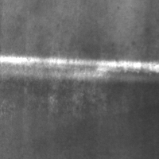
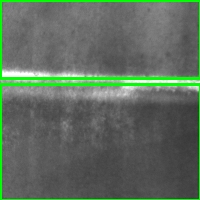
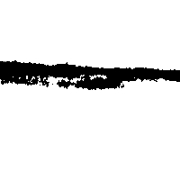

# 🔬 Metal Surface Defect Detection using OpenCV

This interactive Streamlit app allows users to explore and detect surface defects on metal using the [Northeastern University (NEU) Surface Defect Dataset](https://www.kaggle.com/datasets/fantacher/neu-metal-surface-defects-data), with multiple OpenCV-based methods.

## 🚀 Features
- Select from 6 defect classes (scratches, inclusion, patches, etc.)
- Preview raw and processed images side-by-side
- Choose between 4 real-time detection modes:
  - `Canny`
  - `Adaptive Thresholding`
  - `Otsu's Thresholding`
  - `Morphological Gradient`
- Adjustable sliders for parameter tuning
- Compact, responsive UI built in Streamlit

## 🧠 Detection Logic (OpenCV)
Implemented in [`utils/defect_detector.py`](utils/defect_detector.py), where image processing modes are controlled by parameters and visualized live.

## 📁 Dataset
This app uses the NEU Metal Surface Defect Dataset:
- 6 defect types
- 300 samples each (200x200 BMP images)
- Source: [Kaggle Dataset](https://www.kaggle.com/datasets/fantacher/neu-metal-surface-defects-data)

> 📌 Dataset should be placed in the `dataset/` folder with subfolders like this, if you want to add your own:
```
dataset/
├── scratches/
│   ├── 1.bmp
│   ├── 2.bmp
│   └── ...
├── patches/
│   ├── 1.bmp
│   └── ...
├── inclusion/
│   └── ...
├── pitted_surface/
├── rolled_in_scale/
├── crazing/
...
```
## 🔗 Live Demo
[Click here to launch the app](https://metal-defect-detector.streamlit.app/)

## ⚙️ Installation (Run locally)

```bash
git clone https://github.com/shamim-sulaiman/vision-opencv-metal-surface-defect.git
cd vision-opencv-metal-surface-defect
pip install -r requirements.txt
streamlit run web_app.py
```

## 📸 Preview
| Original | Processed | Edge Output |
|----------|-----------|-------------|
|  |  |  |

## 🧑‍💻 Author
Built by **Shamim Sulaiman**  
🔗 [shamimsulaiman.com](https://shamimsulaiman.com)
